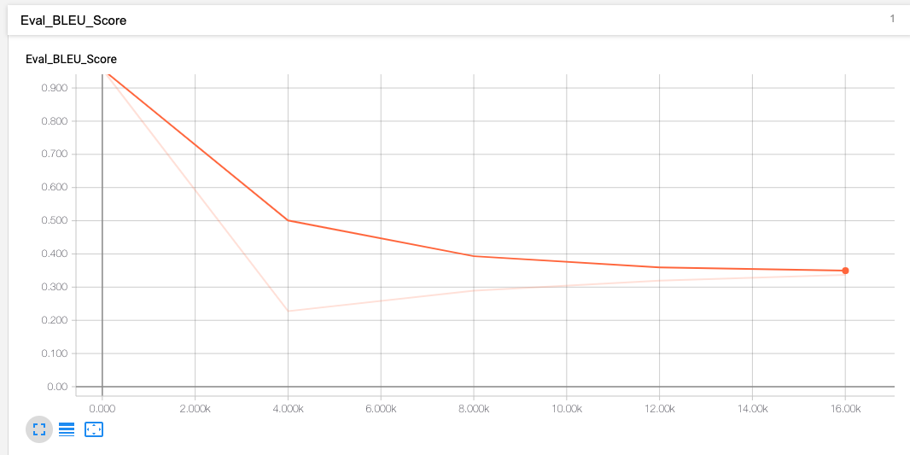
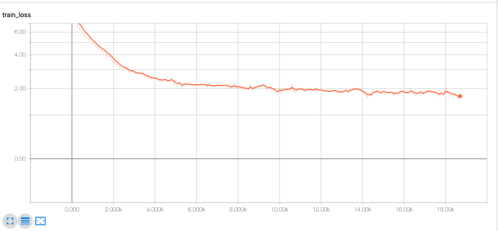
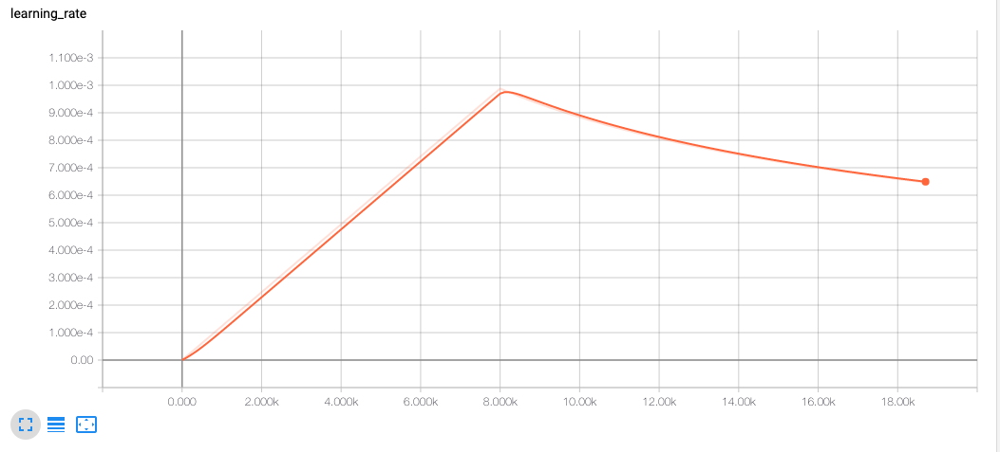

# Homework 9: Distributed Training and Neural Machine Translation

## File Submission and Screenshots

### nohup.out: https://github.com/hoichunlaw/berkeley-w251/tree/master/hw09/nohup.out

### BLEU Score on val set

### Train Loss

### Eval Loss

### Learning Rate

## Answer to Questions

### How long does it take to complete the training run? (hint: this session is on distributed training, so it will take a while)

I left the training to run overnight for 7 hours. 18900 steps were completed.

### Do you think your model is fully trained? How can you tell?

The model is still not yet fully trained. From tensorflow board, we can see training loss and validation loss still going down. For fully trained model, we should pass a point where training loss still going down and validation loss going up. (model passed the optimal point and started to get overfitting)

### Were you overfitting?

No. As mentioned in previous question, training loss and val loss were still going down when I stopped the training.

### Were your GPUs fully utilized?

Yes. I could see ~100% usage of GPU memory for both containers.

### Did you monitor network traffic (hint: apt install nmon ) ? Was network the bottleneck?

The max transfer speed between containers is 1000 Mbps. From nmon I can see the two containers were transferring data at 200 Mbps. Looks like network speed was not the bottleneck of training.

### Take a look at the plot of the learning rate and then check the config file. Can you explan this setting?

Learning rate increased and then decreased. Optimizer used was Lazy Adam, this optimizer changes learning rate depends on history of gradient values. At first few steps, the optimizer estimated the momentum and increased the learning rate for faster learning in right directions. After that the RMSprop part slowly decrease the learning rate as model started to converge.

### How big was your training set (mb)? How many training lines did it contain?

English corpus is 915MB, German corpus is 976MB, 4,524,868 training lines.

### What are the files that a TF checkpoint is comprised of?

A data file, an index file and a meta file.

### How big is your resulting model checkpoint (mb)?

830 MB

### Remember the definition of a "step". How long did an average step take?

1.7s per step

### How does that correlate with the observed network utilization between nodes?

The shorter the step training time, the more network data flow between nodes.